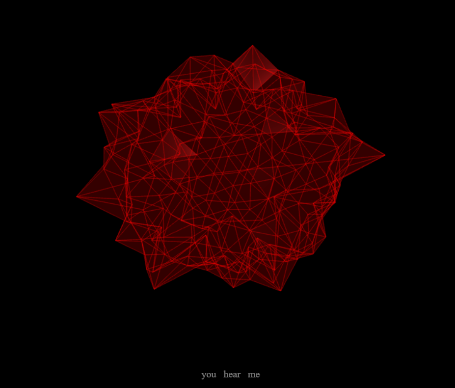

# Pulse

A real-time, voice-reactive 3D visualiser with speech recognition, running entirely in the browser.



## What it does

- A wireframe 3D blob deforms in real time with the volume of your voice, read from the microphone
- Live captions: the last three recognised words fade in at the bottom of the screen
- Wake-word detection: saying "hey compass" switches to conversation mode (the recognised question is currently logged to the console, with no answers yet)
- Push-to-talk notes: hold **V**, speak, release; the note is saved to `localStorage` and downloaded as a `.txt` file

## How it works

**Audio to motion.** The microphone is read through the Web Audio API (`getUserMedia` and an `AnalyserNode`). Every frame, the average of the frequency bins gives a volume level. A power curve (exponent 0.6) makes quiet sounds visible, and an asymmetric linear interpolation (fast attack of 0.3, slow release of 0.03) makes the shape react quickly to loud sounds and relax slowly. A slow sine "idle breath" keeps it alive in silence.

**Deformation.** The original vertex positions of an icosahedron are stored once. Every frame, each vertex is moved along its original direction by `1 + noise * amplitude`, where `noise` is 4D simplex noise sampled at (x, y, z, time). Using time as the fourth dimension makes the motion smooth and organic. Normals are recomputed each frame so the lighting follows the new shape.

**Speech.** The browser's Web Speech API runs in continuous mode with interim results, so the captions update while you speak. A small state machine (idle, conversation, note mode) handles the wake word and the push-to-talk notes.

## Tech

JavaScript (ES modules), [Three.js](https://threejs.org/) r128, [simplex-noise](https://github.com/jwagner/simplex-noise.js) 2.4.0, Web Audio API, Web Speech API.

## Run it

Chrome is required for speech recognition. ES modules need a local server, so double-clicking `index.html` won't work:

```
python -m http.server 8000
```

Then open `http://localhost:8000` in Chrome and allow microphone access. Note that Chrome's speech recognition sends audio to Google's servers.

## Project structure

| File | Purpose |
|------|---------|
| `index.html` | Page, styles for the live captions, library imports |
| `main.js` | Animation loop: maps audio volume to the deformation of the mesh |
| `scene.js` | Three.js scene, camera, lights, mesh and renderer |
| `audio.js` | Microphone setup and audio analyser |
| `speech.js` | Speech recognition, wake word and note mode |
| `dom.js` | Updates the live captions |
| `storage.js` | Saves notes to `localStorage` and downloads them as text files |

## Limitations and next steps

- Conversation mode doesn't answer yet; connecting a language model is the next step
- Only works in Chrome-based browsers
- The wake word is a placeholder
- Recognition doesn't restart automatically when the browser ends the session

## Credits

Built with Three.js and simplex-noise. Parts of the code were written with help from Claude (Anthropic)